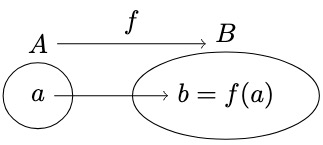

## Definitions

Function

  -  Given two sets A, B, we call $`f : A \rightarrow B`$ is a function, where $`S_f \subseteq A \times B \text{ satisfying for each } a \in A, \text{ there exists } b \in B \text{ uniquely s.t. } (a, b) \in S_f`$. That is, every element of A relates to exactly one element of B.

  - The domain of $`f`$ is $`Dom(f)=A`$.

  - The codomain of $`f`$ is $`Cdm(f)=B`$.

  - The image$`_{range}`$ of $`f`$ is the set, which is defined as $`Img(f) = f(A) = f[A]`$  
    $`:= \{ b = f(a) | a \in A \}$`$  
    $`= \{ b \in B | \exists a \in A(f(a) = b)\} \subseteq B`$.

  - The inverse$`_{pre}`$ image of $`B_1\subset B`$ under f is the set, which is defined as $`Img^{-1}(f) = f^{-1}(B_1) = f^{-1}[B_1]`$  
    $`:= \{ a \in A | f(a) \in B_1 \} \subseteq A`$  
    $`= \{ a \in A | \exists b \in B_1(b = f(a)) \} \subseteq A`$

    - If there is no element of A whose images lie in $B_1$, $`f^{-1}(B_1) = \emptyset`$.

Injective

  - Let f: A $\rightarrow$ B a function, f is one to one if $`f(x_1) = f(x_2)`$ then $`x_1 = x_2 \Leftrightarrow \text{if } x_1 \neq x_2 \text{then } f(x_1) \neq f(x_2)`$.

Surjective

  - Let f: A $\rightarrow$ B a function, f is onto if $`\forall b \in B \exists a \in A(f(a) = b)`$.

Inverse function

  - Let f: A $\rightarrow$ B a function, which is bijective(one to one, onto). Then we can define $f^{-1}$: B $\rightarrow$ A, called inverse function.  i.e., $`S_{f^{-1}} := \{ (b, a) \in B \times A | f(a) = b \} \subset B \times A`$.

Function composition

  - Given two functions f: A $\rightarrow$ B, g: B $\rightarrow$ C, define g $\circ$ f: A $\xrightarrow{f}$ B $\xrightarrow{g}$ C, i.e., (g $\circ$ f)(x) = g(f(x)), $`S_{g \circ f} = \{ (x, g(f(x)) | x \in A \} \subset A \times C`$.

Relation

  - Given two sets A, B, a relation R $`\subset A \times B`$, i.e., for each (a, b) $\in$ R, denote $`a`$ ~ $_{R}b$.
    - ex. $`A = \{ 1, 2 \}, B = \{ 4, 5 \}, A \times B = \{ (1, 4), (1, 5), (2, 4), (2, 5) \}`$.  
      $`R = \{ (1, 4), (2, 5) \} \Leftrightarrow`$ $`1`$ ~ $`_{R}4`$ , $`2`$ ~ $`_{R}5`$

Equivalence relation

  - Let R $\subseteq$ A $\times$ A be a relation. We say that R is an equivalence relation if R satisfies ...
    1. Reflexive: For each x $\in$ A, (x, x) $\in$ R, i.e., $`x`$ ~ $`_{R}x`$.
    2. Symmetric: If (x, y) $\in$ R then (y, x) $\in$ R, i.e., if $`x`$ ~ $`_{R}y`$ then $`y`$ ~ $`_{R}x`$.
    3. Transitive: If (x, y) $\in$ R and (y, z) $\in$ R, then (x, z) $\in$ R, i.e., if $`x`$ ~ $`_{R}y`$ and $`y`$ ~ $`_{R}z`$ then $`x`$ ~ $`_{R}z`$.
  
  - ex. $`A = \{ 1, 2, 3, 4 \}, R = \{ (1, 1), (2, 2), (3, 3), (4, 4), (1, 2), (2, 1) \}`$.[^equivalence_relation_0]

## Exercises

Given f: A $\rightarrow$ B a function, let A₁, A₂ ⊆ A, show that ...

  - 

f(A₁ ∪ A₂) = f(A₁) ∪ f(A₂)

    $`\begin{flalign}
    \text{Need to show.} &&\\
    f(A_1 \cup A_2) \subseteq f(A_1) \cup f(A_2) \;\; and \;\; f(A_1) \cup f(A_2) \subseteq f(A_1 \cup A_2) &&\\
    &&\\
    \text{Proof.} &&\\
    \text{Recall that } b \in f(A) \Leftrightarrow \exists a \in A(f(a) = b). &&\\
    (\subseteq) &&\\
    \text{Let } b \in f(A_1 \cup A_2). &&\\
    \Leftrightarrow \exists a \in A_1 \cup A_2(f(a) = b) &&\\
    \Leftrightarrow \exists a((a \in A_1 \cup A_2) \land (f(a) = b)) &&\\
    \Leftrightarrow \exists a((a \in A_1 \lor a \in A_2) \land (f(a) = b)) &&\\
    \Leftrightarrow \exists a((a \in A_1 \land (f(a) = b)) \lor (a \in A_2 \land (f(a) = b))) &&\\
    \Rightarrow f(a) \in f(A_1) \lor f(a) \in f(A_2) &&\\
    \Leftrightarrow b \in f(A_1) \cup f(A_2) &&\\
    (\supseteq) &&\\
    \text{Let } b \in f(A_1) \cup f(A_2). &&\\
    \Leftrightarrow b \in f(A_1) \lor b \in f(A_2) &&\\
    \text{(Case 1) } b \in f(A_1) \Rightarrow \exists a_1 \in A_1(f(a_1) = b) &&\\
    \text{(Case 2) } b \in f(A_2) \Rightarrow \exists a_2 \in A_2(f(a_2) = b) &&\\
    \text{That is, } \exists a \in A_1 \cup A_2(f(a) = b). &&\\
    \Leftrightarrow \exists a((a \in A_1 \cup A_2) \land (f(a) = b)) &&\\
    \Rightarrow b \in f(A_1 \cup A_2) &&\\
    \end{flalign}`$

    

  - 

f(A₁ ∩ A₂) ⊆ f(A₁) ∩ f(A₂)

    $`\begin{flalign}
    \text{Need to show.} &&\\
    f(A_1 \cap A_2) \subseteq f(A_1) \cap f(A_2) \;\; and \;\; f(A_1) \cap f(A_2) \nsubseteq f(A_1 \cap A_2) &&\\
    &&\\
    \text{Proof 1.} &&\\
    \text{Recall that } b \in f(A) \Leftrightarrow \exists a \in A(f(a) = b). &&\\
    (\subseteq) &&\\
    \text{Let } b \in f(A_1 \cap A_2). &&\\
    \Leftrightarrow \exists a \in A_1 \cap A_2(f(a) = b) &&\\
    \Leftrightarrow \exists a((a \in A_1 \cap A_2) \land (f(a) = b)) &&\\
    \Leftrightarrow \exists a((a \in A_1 \land a \in A_2) \land (f(a) = b)) &&\\
    \Leftrightarrow \exists a((a \in A_1 \land (f(a) = b)) \land (a \in A_2 \land (f(a) = b))) &&\\
    \Rightarrow f(a) \in f(A_1) \land f(a) \in f(A_2) &&\\
    \Rightarrow b \in f(A_1) \cap f(A_2) &&\\
    (\nsupseteq) &&\\
    \text{Counter example. Let } A_1 = \{ 1, 2 \}, A_2 = \{ 2, 3 \}, B = \{ 4, 5 \}, S_f = \{ (1, 4), (2, 5), (3, 4) \}. &&\\
    f(A_1) \cap f(A_2) = \{ 4, 5 \} &&\\
    f(A_1 \cap A_2) = \{ 5 \} &&\\
    &&\\
    \text{Proof 2.} &&\\
    \text{If b ∈ B is in f(A₁ ∩ A₂), then b = f(a) for some a ∈ A₁ ∩ A₂.} &&\\
    \text{Since a ∈ A₁ ∩ A₂, a is in both A₁ and A₂.} &&\\
    \text{Therefore, b = f(a) is in both f(A₁) and f(A₂), that is, b ∈ f(A₁) ∩ f(A₂).} &&\\
    \end{flalign}`$

    

Given f: A $\rightarrow$ B a function, let B₁, B₂ ⊆ B, show that ...

  - 

$f^{-1}$(B₁ ∪ B₂) = $f^{-1}$(B₁) ∪ $f^{-1}$(B₂)

    $`\begin{flalign}
    \text{Need to show.} &&\\
    f^{-1}(B_1 \cup B_2) \subseteq f^{-1}(B_1) \cup f^{-1}(B_2) \;\; and \;\; f^{-1}(B_1) \cup f^{-1}(B_2) \subseteq f^{-1}(B_1 \cup B_2) &&\\
    &&\\
    \text{Proof.} &&\\
    \text{Recall that } a \in f^{-1}(B) \Leftrightarrow f(a) \in B. &&\\
    (\subseteq, \supseteq) &&\\
    \text{Let } a \in f^{-1}(B_1 \cup B_2). &&\\
    \Leftrightarrow f(a) \in B_1 \cup B_2 &&\\
    \Leftrightarrow f(a) \in B_1 \lor f(a) \in B_2 &&\\
    \Leftrightarrow a \in f^{-1}(B_1) \lor a \in f^{-1}(B_2) &&\\
    \Leftrightarrow a \in f^{-1}(B_1) \cup f^{-1}(B_2) &&\\
    \end{flalign}`$

    

  - 

$f^{-1}$(B₁ ∩ B₂) = $f^{-1}$(B₁) ∩ $f^{-1}$(B₂)

    $`\begin{flalign}
    \text{Need to show.} &&\\
    f^{-1}(B_1 \cap B_2) \subseteq f^{-1}(B_1) \cap f^{-1}(B_2) \;\; and \;\; f^{-1}(B_1) \cap f^{-1}(B_2) \subseteq f^{-1}(B_1 \cap B_2) &&\\
    \text{Proof.} &&\\
    \text{Recall that } a \in f^{-1}(B) \Leftrightarrow f(a) \in B. &&\\
    (\subseteq, \supseteq) &&\\
    \text{Let } a \in f^{-1}(B_1 \cap B_2). &&\\
    \Leftrightarrow f(a) \in B_1 \cap B_2 &&\\
    \Leftrightarrow f(a) \in B_1 \land f(a) \in B_2 &&\\
    \Leftrightarrow a \in f^{-1}(B_1) \land a \in f^{-1}(B_2) &&\\
    \Leftrightarrow a \in f^{-1}(B_1) \cap f^{-1}(B_2) &&\\
    \end{flalign}`$

    

  

Given f: A $\rightarrow$ B a function, let A₁ ⊆ A, B₁ ⊆ B, show that ...

  - 

$f(f^{-1}(B_1)) \subseteq B_1$

    $`\begin{flalign}
    \text{Proof.} &&\\
    \text{Let } b \in f(f^{-1}(B_1)). &&\\
    \Leftrightarrow \exists a \in f^{-1}(B_1)(b = f(a)) &&\\
    \Leftrightarrow \exists a (a \in f^{-1}(B_1) \land b = f(a)) &&\\
    \text{Since } a \in f^{-1}B_1, f(a) \in B_1. &&\\
    \Rightarrow b \in B_1
    \end{flalign}`$

    

  - 

$f^{-1}(f(A_1)) \supseteq A_1$

    $`\begin{flalign}
    \text{Proof.} &&\\
    \text{Recall that } &&\\
    \quad f^{-1}(B_1)    := \{ a \in A | f(a) \in B_1 \}, &&\\
    \quad f(A_1)         := \{ f(a) \in B | a \in A_1 \}, &&\\
    \quad f(f^{-1}(B_1)) := \{ f(a) \in B | a \in f^{-1}(B_1) \}, &&\\
    \quad f^{-1}(f(A_1)) := \{ a \in A | f(a) \in f(A_1) \}. &&\\
    \text{Let } a \in A_1. &&\\
    \Rightarrow f(a) \in f(A_1) &&\\
    \Rightarrow a \in f^{−1}(f(A_1)) \text{ (by the definition of the preimage)} &&\\
    \end{flalign}`$

    

  - 

$f(f^{-1}(B_1)) \nsupseteq B_1$

    $`\begin{flalign}
    \text{Proof.} &&\\
    \text{Suppose that } b \in B_1, \text{but } b \notin f(A). &&\\
    \text{Then, } b \notin f(f^{-1}(B_1)) \text{ since there is no element in } f^{-1}(B_1) \text{ such that } f(a) = b. &&\\
    \end{flalign}`$

    

  - 

$f^{-1}(f(A_1)) \nsubseteq A_1$

    $`\begin{flalign}
    \text{Proof.} &&\\
    \text{Suppose that } a \in A_1^{\complement}, a \in A, f(a) \in f(A_1). &&\\
    \text{Then, } a \in f^{-1}(f(A_1)), \text{but } a \notin A_1. &&\\
    \end{flalign}`$

    

Given two sets A, B($\subset$ X) and functions f: A $\rightarrow$ B, $id_A$: A $\rightarrow$ A(a $\mapsto$ a), $id_B$: B $\rightarrow$ B(b $\mapsto$ b). Show that ...

  - 

f is one to one if and only if there exists g: B $\rightarrow$ A such that g $\circ$ f = $id_A$.

    $`\begin{flalign}
    \text{Proof.} &&\\
    (\Rightarrow) &&\\
    \text{Pick any } p \in A. &&\\
    \text{Define } g(=g_p): B \rightarrow A, \begin{cases}
      b \mapsto a \text{ if }b \in img(f)(\Leftrightarrow \text{there exists unique } a \in A \text{ such that } b = f(a)) \\
      b \mapsto p \text{ if } b \notin img(f) \\
    \end{cases} &&\\
    \text{Then g is well-defined.} &&\\
    &&\\
    (\Leftarrow) &&\\
    \text{Assume that there exists } g: B \rightarrow A \text{ s.t. } g \circ f = id_A. &&\\
    \text{Suppose that } f(a_1) = f(a_2) \text{ for any } a_1, a_2 \in A. \text{ Then, } g(f(a_1)) = g(f(a_2)) \text{ (by def. of function)}. &&\\
    \text{Therefore } a_1 = a_2 \text{ (by assumption } g \circ f = id_A). &&\\
    \end{flalign}`$

    

  - 

f is onto if and only if there exists g: B $\rightarrow$ A such that f $\circ$ g = $id_B$.

  
    

Given a set A, consider F = P(A) = { subsets of A }. Define R := { (x, y) $\in$ F x F | there exists a one to one, onto function f: X → Y }. Show that R is an equivalence relation.

  - Reflexive
    - $`\text{For each } x \in F, \text{we have } id_{X}: X \rightarrow X.`$
  
  - Symmetric
    - Suppose $`X`$~$`_{R}Y`$, i.e., there exists a one to one, onto function f: X $\rightarrow$ Y. Then there also exist g: Y $\rightarrow$ X s.t. g $\circ$ f = $`id_{X}`$ and f $\circ$ g = $`id_{Y}`$.
    - Given f: A $\rightarrow$ B and g: B $\rightarrow$ C,
      - If g $\circ$ f: A $\rightarrow$ C is onto, then g is onto. 
        Proof. 
        $`\quad\forall z \in C \exists x \in A(g(f(x)) = z)`$ 
        $`\Rightarrow \forall z \in C \exists y = f(x) \in B(g(y) = z)`$
      - If g $\circ$ f: A $\rightarrow$ C is one to one, then f is one to one. 
        Proof. 
        Suppose $`f(x_{1}) = f(x_{2})`$. Since g is a function, $`g(f(x_{1})) = g(f(x_{2}))`$. Then $`x_{1} = x_{2}`$($\because$ g $\circ$ f is injective).
      - Therefore g must be one to one, onto. In fact, $`g = f^{-1}`$(Inverse function). Hence, $`Y`$~$`_{R}X`$
  
  - Transitive
    - 

## TODO

Given f: A $\rightarrow$ B a function, show that A $\subseteq$ B $\Rightarrow$ f(A) $\subseteq$ f(B).

### References

- Patrick Keef, David Guichard, *An Introduction to Higher Mathematics*
- James Munkres, *Topology*
- [수학의 즐거움, Enjoying Math, "수학 공부, 기초부터 대학원 수학까지, 1. 집합론 기초 (a)"](https://youtu.be/9HUk8zays2E?feature=shared)
- [수학의 즐거움, Enjoying Math, "수학 공부, 기초부터 대학원 수학까지, 1. 집합론 기초 (b)"](https://youtu.be/k53Sr9Q9NR8?feature=shared)
- [수학의 즐거움, Enjoying Math, "\[기초부터 대학원 수학까지 시리즈 스터디 3기\] 2. 집합론 기초 2강"](https://youtu.be/PPYhmRwbEno?feature=shared)
- [수학의 즐거움, Enjoying Math, "\[기초부터 대학원 수학까지 시리즈 스터디 3기\] 3. 집합론 기초: 단사, 전사 및 역함수와 합성함수"](https://youtu.be/YJWaI8RW_zE?feature=shared)
- [Hacker-Code-J, GitHub repository](https://github.com/Hacker-Code-J/Modern-Mathematics/blob/main/grad-math-mini/grad-math-mini-1.pdf)

[^equivalence_relation_0]: It's also equivalence relation if we remove (1, 2), (2, 1), i.e. symmetric is optional.
