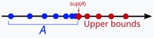

## Definitions

Bounded

  - Let $E \subseteq \mathbb{R}$. We say $E$ is bounded above(below) if there exists $\beta(\alpha) \in \mathbb{R}$ s.t. for each $x \in E, x \leq \beta(x \geq \alpha)$. In this case, $\beta(\alpha)$ is called an upper(lower) bound.
  
  - $E$ is bounded if $E$ is both bounded above and below.

  - Remark.
    1. $E = \emptyset$ is possible.
    2. $\beta, \alpha$ are not unique.
       - $\beta, \beta + 1, \beta + 2, \dots$
       - $\alpha, \alpha - 1, \alpha - 2, \dots$
       - ex. $`A = \{ 1 - \frac{1}{n} | n \in \mathbb{N} \} `$
       - ex. $\mathbb{N}$ has a lower bound, but doesn't have an upper bound.
       - ex. $`B = \{ r \in \mathbb{Q} | r > 0 \text{ and } r^2 < 2 \}`$. Then $B$ has a lower bound($\alpha = 0$). However, $B$ doesn't have the maximum element. \
         To show it, it is enough to show that if $p \in B$, then there exists $q \in B$ s.t. $p < q$.
         Take any $p \in B(\Leftrightarrow p > 0, p^2 < 2, p \in \mathbb{Q})$. \
         Take $q = p + \frac{2 - p^2}{p + 2}$. Since $\mathbb{Q}$ is field, then $q \in \mathbb{Q}$. \
         $2 - q = (\dots) = \frac{-2p^2 + 4}{(p+2)^2} > 0$ \
         $\therefore q \in B< 2$

Least upper bound property(=Completeness axiom)

  - Let $\emptyset \neq E \subseteq \mathbb{R}$ be bounded above. We say $\beta \in \mathbb{R}$ is the least upper bound of $E$ if:
    1. $\beta$ is an upper bound of $E$.
    2. If $\alpha < \beta$, then $\alpha$ is not an upper bound of $E$.
    
    We denote $\beta = supE$, called the supremum of $E$.

    

  - Remark.
    1. If $supE$ exists, then $supE$ must be unique. \
       $\because$ Let $\alpha, \beta$ be supremum of $E$. Then either:
       - $\alpha < \beta$(↯, by def. of least upper bound)
       - $\alpha = \beta$
       - $\alpha > \beta$(↯, by def. of least upper bound).
    2. Suppose $\emptyset \neq E \subseteq \mathbb{R}$ is not bounded above, i.e., ~(there exists $\beta$ s.t. for each $x \in E, x \leq \beta$). \
       $\Leftrightarrow$ For all $\beta \in \mathbb{R}$ there exists $x_{\beta} \in E \text{ s.t. } x_{\beta} > \beta$.
    3. Let $\emptyset \neq E \subseteq \mathbb{R}$ be not bounded above. \
       $\Rightarrow supE = \infty(\notin \mathbb{R})$
    4. $sup\emptyset = -\infty$
    5. Let $\emptyset \neq E \subseteq \mathbb{R}$ be bounded above. \
       $\Rightarrow$ There exists $supE = \beta \in \mathbb{R}$. (by def.) \
       Then for each $\epsilon > 0, \beta - \epsilon$ is not an upper bound. Thus by [ii.](#remark_second_item), there exists $x_{\epsilon} \in E$ s.t. $\beta - \epsilon < x_{\epsilon}$. \
       Consequently, for each $\epsilon > 0$, there exists $x_{\epsilon} \in E$ s.t. $\beta - \epsilon < x_{\epsilon} \leq \beta$. \
       This is equivalent statement to say $\beta = supE$.
    6. For each $n \in \mathbb{N}(\epsilon = \frac{1}{n} > 0)$, by [v.](#remark_fifth_item), there exists $x_{n} \in E$ s.t. $\beta - \frac{1}{n} < x_{n} \leq \beta$. \
       In particular, this shows that we can find a sequence ($x_{n}$) s.t. $\lim_{n\to\infty} x_{n} = \beta$. \
       In fact, [vi.](#remark_sixth_item) is equivalent to [v.](#remark_fifth_item). This is called Archimedean property.

Mathematical induction, Well-ordering principle

  - $`\text{Mathematical induction}_{M.I.}`$ \
    Let $A \subseteq \mathbb{N}$. If \
    $\quad$ ① $1 \in A$, \
    $\quad$ ② If $n \in A, \text{ then } n + 1 \in A$, \
    then $A = \mathbb{N}$.

  - $`\text{Well-ordering principle}_{W.O.}`$ \
    Let $A \subseteq \mathbb{N}, A \neq \emptyset$. Then there exists minimum of $A$.

  - $Proposition.$ $M.I.$ and $W.O.$ are equivalent. \
    $Proof.$ \
    ($W.O. \Rightarrow M.I.$) \
    Suppose $M.I.$ is false, i.e., let $`A \subseteq \mathbb{N} \text{ satisfying ①, ②, but } A \neq \mathbb{N}(*)`$. \
    By $`(*), \mathbb{N} - A \neq \emptyset(\mathbb{N} - A \text{ is proper subset of } \mathbb{N})`$. \
    Apply $W.O.$ Then there exists the minimum $m_0 \in \mathbb{N} - A$. \
    But, $1 \in A, 2 \in A, \dots , m_0 \in A$. (↯, $m_0 \in \mathbb{N} - A$) \
    Thus $A = \mathbb{N}$. \
     
    ($M.I. \Rightarrow W.O.$) \
    Let $A$ be non-empty subset of $\mathbb{N}$. \
    Suppose $W.O.$ is false for $A$. \
    i.e., there is no minimum of $A$. \
    Define $`B := \{ k \in \mathbb{N} | k \leq n \text{ for any } n \in A \}`$. \
    Since $`1 \notin A(\because \; 1 \text{ is minimum}), 1 \in B(\Rightarrow B \neq \emptyset).`$ \
    Let $m \in B$, then $m \notin A$. \
    Thus $`m + 1 \in B(\because\; \text{For any } n \in A, m < n, m + 1 \leq n)`$. \
    $\Rightarrow B = \mathbb{N}$ (by $M.I.$)\
    $\Rightarrow A = \emptyset$ (↯)

Archimedean property

  - Let $x, y \in \mathbb{R}$ with $x > 0$. Then there exists $n \in \mathbb{N}$ s.t. $nx > y$. \
    $Proof.$ \
    If $y \leq 0$, take $n = 1.(1 \times x > y).$ So suppose $y > 0$. \
    $Claim$: there exists $`n \in \mathbb{N} \;\:s.t.\;\: nx > y`$. \
    Suppose not, i.e., for each $n \in \mathbb{N}, nx \leq y$. \
    Define $`E :=  \{ nx | n \in \mathbb{N} \},`$ \
    Then $\emptyset \neq E \subseteq \mathbb{R}$, $E$ is bounded above by $y$. \
    Thus there exists $supE = \beta \in \mathbb{R}$. \
    Since $x > 0, \text{ then } \beta - x < \beta.$ \
    $\Rightarrow \beta - x$ is not an upper bound. \
    So there exists $`n \in \mathbb{N} \;\:s.t.\;\: \beta - x < nx \in E \leq \beta`$. \
    $\Rightarrow \beta < (n + 1)x, n + 1 \in \mathbb{N}$ \
    $\Rightarrow (n + 1)x \in E$ (↯, $\beta$ is an upper bound)
  
  - Remark.
    1. Take $x = \epsilon > 0, y = 1$. \
       Then by this property, there exists $`n \in \mathbb{N} \;\:s.t.\;\: n - \epsilon > 1(\Leftrightarrow \frac{1}{n} < \epsilon)`$.
    2. Let $\emptyset \neq E \subseteq \mathbb{R}$ be a non-empty, bounded above. \
       $\Rightarrow$ There exists $supE = \beta \in \mathbb{R}$. \
       $\Leftrightarrow$ For each $\epsilon > 0$, there exists $`x_{\epsilon} \in E \;\:s.t.\;\: \beta - \epsilon < x_{\epsilon} \leq \beta`$. \
       $\Leftrightarrow$ For each $n \in \mathbb{N}(\epsilon = \frac{1}{n})$, there exists $`x_n \in E \;\:s.t.\;\: \beta - \frac{1}{n} < x_n \leq \beta`$. $\dots$ (\*\*) \
       In fact , ($\Leftarrow$) holds as well. \
       Suppose (\*\*) holds, \
       Let $\epsilon > 0$ be fixed. Then by $A.P.$, there exists $`n \in \mathbb{}N \;\:s.t.\;\: \frac{1}{n} < \epsilon`$. (by [i.](#ap_remark_first_item)) \
       $\Leftrightarrow -\frac{1}{n} > -\epsilon \Leftrightarrow \beta - \frac{1}{n} > \beta - \epsilon$ \
       Thus for each $\epsilon > 0$, there exists $`n \in \mathbb{N} \;s.t.`$ for corresponding $x_n \in E$ satisfying \
       $\beta - \epsilon < \beta - \frac{1}{n} < x_n \leq \beta$. \
       Consequently, we have a sequence $`(x_n)_{n=1}^{\infty} \text{ s.t. } \lim_{n\to\infty} x_{n} = \beta`$. \
       \
       Note. 위의 논지(argument)는 $\beta$를 handling하는데 있어서 $\beta$로 수렴하는 수열로 다룰 수 있고, uncountable한 $\epsilon > 0$의 선택지를 countable한 $n$으로 다룰 수 있음을 시사한다.
   
   - Density of $\mathbb{Q}$(유리수의 조밀성) \
     For any $x, y \in \mathbb{R}$ with $x < y$, there exists $`r \in \mathbb{Q} \;\:s.t.\;\: x < r < y`$. \
     $Proof.$ \
     There are 3 cases for $x < y$. \
     ①$`x < 0 < y`$ \
     ②$`0 < x < y`$ \
     ③$`x < y < 0`$ \
     It suffices to show ②. \
     With 1, there exists $`n \in \mathbb{N} \;\:s.t.\;\: n(y - x) > 1`$ by $A.P.$($\Leftrightarrow nx + 1 < ny$) \
     $`Purpose.\; x < \frac{m}{n} < y`$ \
     Define $`A := \{ k \in \mathbb{N} | nx < k \} \neq \emptyset`$ \
     $`\Rightarrow \emptyset \neq A \subseteq \mathbb{N}`$. \
     By $W.O.$, there exists the smallest element $m_0 \in A$, i.e., $nx < m_0$ but $nx \geq m_0 - 1$. \
     So, $m_0 - 1 \leq nx < m_0$ \
     $\Rightarrow nx < m_0 \leq nx + 1 < ny$ \
     $\Rightarrow nx < m_0 < ny$ \
     $\Leftrightarrow x < \frac{m_0}{n} < y$. \
     $Remark.$ $m_0$ was coming from $W.O.$ and $n$ was coming from $sup$.

Convergence of sequences

  - We say $`\{ a_{n} \}_{n = 1}^{\infty}(\subseteq X, \text{X is topological space})`$ is a sequence if it is a function $`\{ a_{n} \}_{n = 1}^{\infty}: \mathbb{N} \rightarrow X(n \mapsto a_{n})`$. In advanced calculus, $`X = \mathbb{R}`$.
  
  - We say a sequence $`\{ a_{n} \}_{n = 1}^{\infty}(\subseteq \mathbb{R})`$ converges to $`\alpha \in \mathbb{R}`$ if for each $`\epsilon > 0`$, there exists $`N_{\epsilon} \in \mathbb{N} \;s.t.\;`$ for any $`n \geq N_{\epsilon}, n \in \mathbb{N}, |a_{n} - \alpha| < \epsilon`$. We denote $`\lim_{x\to\infty}a_{n} = \alpha`$. Otherwise, we say $`\{ a_{n} \}`$ diverges.

    Remark.
    - Step ⓪: For each $`\epsilon > 0`$($`\epsilon`$ is fixed)
    - Step ①: there exists corresponding $`N_{\epsilon} \in \mathbb{N}`$,
    - Step ②: for any $`n \geq N_{\epsilon}, n \in \mathbb{N}`$($n$ is fixed but arbitrary),
    - Step ③: $`|a_{n} - \alpha| < \epsilon`$.
  
  - ex. $`a_{n} = \frac{1}{n},`$ for each $`n \in \mathbb{N}`$. \
    Claim: $`\lim{n\to\infty}\frac{1}{n} = 0`$ \
    By Archimedean property, there exists $`N_{\epsilon} \in \mathbb{N} \;s.t.\; N_{\epsilon} \times \epsilon > 1 \Leftrightarrow \frac{1}{N_{\epsilon}} < \epsilon`$. \
    Then for any $`n \geq N_{\epsilon} \Leftrightarrow \frac{1}{n} \leq \frac{1}{N_{\epsilon}},`$ \
    $`|a_{n} - \alpha| = |\frac{1}{n} - 0| = \frac{1}{n} \leq \frac{1}{N_{\epsilon}} < \epsilon, \;i.e.\; |a_{n} - \alpha| < \epsilon`$. \
    Hence, $`\lim{n\to\infty}a_{n} = 0`$.

## Exercises

Let $A = \{ 1 - \frac{1}{n} | n \in \mathbb{N} \}$. Show that $A$ has an upper bound and a lower bound.

  Proof. \
  For all $n \in \mathbb{N}, 1 - \frac{1}{n} = \frac{n-1}{n} < 1 = \frac{n}{n}$. \
  $\Rightarrow$ 1 is an upper bound of A. \
  For all $n \in \mathbb{N}, 1 - \frac{1}{n} \geq 0.$ \
  $\Rightarrow$ 0 is an lower bound of A.

### References

- [수학의 즐거움, Enjoying Math, "수학 공부, 기초부터 대학원 수학까지, 4. 해석학 개론 (a) 완비성 공리"](https://youtu.be/pHIImTBdBRs?feature=shared)
- [수학의 즐거움, Enjoying Math, "수학 공부, 기초부터 대학원 수학까지, 5. 해석학 개론 (b) 유리수의 조밀성와 실수, 자연수 공리"](https://youtu.be/RYjhQyXxTpQ?feature=shared)
